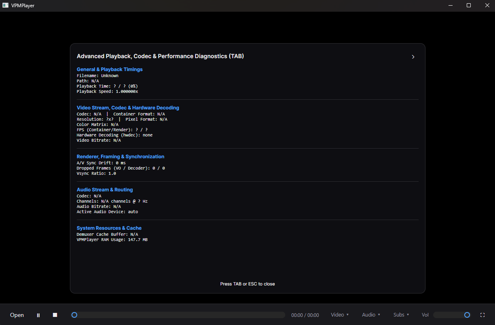

# 🎬 VPMPlayer

### *A portable mpv frontend*
[](https://github.com/PartakithRC1/VPMPlayer/releases) [](https://github.com/PartakithRC1/VPMPlayer/releases/latest)

**Engine:** mpv · **Runtime:** .NET 8 · **UI:** Avalonia · **Portability:** Fully xcopy-deployable
Bundled with 2026-08-11 [MPV](https://github.com/zhongfly/mpv-winbuild/releases?page=4#release-2026-08-11-f4d13e1c2c) [mpv-player/mpv@f4d13e1](https://github.com/mpv-player/mpv/commit/f4d13e1c2c91f3a56e589aef9cb44cbc02e26e47)
---
[VirusTotal Scan](https://www.virustotal.com/gui/file/46a45c3a42e06849e19a35e823fa0fdfaaa892e43245cdea0e43426de35cac3d?nocache=1)
Hello everyone! I was making this for myself but figured it couldn't hurt to share. I am not including the src at this moment :) but the code is by no means hard to get if you can't wait.
The below description was generated and looked over by me...I feel as with anything it oversells it...some of the features need work or aren't where I want them to be yet. Which is why I would like people to get in touch!
Keep an eye on this and I will upload a discord link in the near future. This current release is the "Alpha" so to speak as its only just gotten started.


> Drop `mpv.exe` in a folder next to VPMPlayer, drop shaders in `shaders/`, and you have a
> codec-agnostic, GPU-shader-capable, hotkey-driven media player that answers to nothing
> but a `.exe` and a folder.

---

## 📚 Table of Contents

1. [What This Is](#-what-this-is)
2. [Core Features](#-core-features)
3. [Hotkey Reference](#️-hotkey-reference)
4. [The Playlist / Queue System](#-the-playlist--queue-system)
5. [GLSL Shaders](#-glsl-shaders)
6. [The mpv Console](#-the-mpv-console)
7. [Diagnostics Overlay](#-diagnostics-overlay)
8. [Tips & Quirks](#-tips--quirks)

---

## 🧭 What This Is

VPMPlayer wraps mpv's engine — the same playback core that anchors most "gold standard"
players for format and codec support — inside a clean Avalonia UI, with the extras that
usually only live in *config files and terminals* surfaced as real, clickable, hotkeyable
features:

| | |
|---|---|
| 🗂️ **Portable** | No install. `.NET 8` + the app folder is the whole dependency chain. |
| 🎨 **Shader-native** | Drop `.glsl` files in a folder — Anime4K and friends just work. |
| ⌨️ **Hotkey-first** | Every core action — seek, speed, volume, playlist — has a key. |
| 🖥️ **A real console** | Send raw mpv IPC commands directly. No config-file archaeology. |
| 📼 **Smart queueing** | Open one episode, it finds the rest of the season on its own. |

---

## ✨ Core Features

### Playback Engine
Powered by mpv over JSON IPC — near-universal format/codec support, hardware decoding,
and frame-accurate seeking, all driven from the GUI.

### 🎨 GLSL Shader Manager — `S`
- Auto-discovers every `.glsl` / `.hlsl` / `.hk` file under the `shaders/` folder (recursively).
- Toggle any combination on with checkboxes — chains apply live, no reload needed.
- Built for multi-pass chains like **Anime4K** (denoise → upscale → sharpen).
- **Clear All Shaders** kill switch for when a chain misbehaves.

### 📼 Playlist / Queue — `P`
- Open **one file** → auto-scans its folder for sibling media and queues the whole batch,
  natural-sorted (`S01E2` correctly lands before `S01E10`).
- Open **multiple files** at once (multi-select or multi-file drag & drop) → queued as-is.
- **Safety cap:** folders with 300+ matching files prompt before auto-queueing everything,
  so a media library folder never gets swallowed by accident.
- Auto-advances to the next item when a file ends.
- Double-click any entry to jump to it; `✕` removes an entry without touching playback.

### 🖥️ Interactive Console — `` ` ``
Type raw mpv commands straight into the running instance:

```
cycle pause
add volume 10
set speed 1.5
```

Full request/response log, so you can see exactly what mpv sends back.

### 📊 Diagnostics Overlay — `Tab`
Live codec, resolution, FPS, hardware-decode status, dropped-frame counts, A/V sync
drift, cache buffer, and VPMPlayer's own RAM usage — the kind of panel usually reserved
for `mpv --stats` or third-party OSD scripts.

### 🎚️ Track Menus
Independent **Video / Audio / Subtitle** track pickers, showing title, language, codec,
and whether a track is external (e.g. a loaded `.srt`).

---

## ⌨️ Hotkey Reference

### Playback

| Key | Action |
|---|---|
| `Space` | Play / Pause |
| `F` | Toggle fullscreen |
| `Esc` | Exit fullscreen *(or close whatever popup is open)* |
| `Ctrl` + `O` | Open file(s) |

### Seeking & Scrubbing

| Key | Action |
|---|---|
| `←` / `→` | Seek **−5s / +5s** |
| `Shift` + `←` / `→` | Seek **−30s / +30s** |
| `J` / `L` | Seek **−10s / +10s** *(editor-style)* |
| `Page Up` / `Page Down` | Seek **+60s / −60s** |
| `Home` / `End` | Jump to start / near the end |
| `0`–`9` | Jump to 0%–90% of the file *(decile scrub)* |
| `,` / `.` | Step back / forward **one frame** *(best while paused)* |

### Volume & Speed

| Key | Action |
|---|---|
| `↑` / `↓` | Volume **+5 / −5** |
| `M` | Toggle mute |
| `-` / `+` | Playback speed **−0.1× / +0.1×** |
| `Backspace` | Reset speed to **1.0×** |

### Playlist / Queue

| Key | Action |
|---|---|
| `P` | Toggle Playlist popup |
| `Ctrl` + `←` / `→` | Previous / Next track in the queue |

### Tools & Overlays

| Key | Action |
|---|---|
| `S` | Toggle GLSL Shader Manager |
| `` ` `` *(backtick)* | Toggle the mpv Console |
| `Tab` | Toggle the Diagnostics Overlay |

> 💡 **Note:** While any popup (Console, Shader Manager, Playlist, Diagnostics) is open,
> `Esc` closes *that* popup first — playback hotkeys resume once it's closed.

---

## 📼 The Playlist / Queue System

VPMPlayer's queueing is deliberately **opinionated but safe**:

- **One file, big folder** → it's almost certainly an episode/track in a series, so the
  whole folder gets queued automatically, in natural watch order.
- **One file, huge folder** *(300+ matches)* → you get asked first. No one wants their
  entire downloads folder queued because they double-clicked one file.
- **Several files selected at once** → treated as an intentional, explicit playlist —
  no folder scanning, no prompts, just queued in natural order.

```
📁 Season 01/
 ├─ S01E01.mkv   ← you open this
 ├─ S01E02.mkv   ┐
 ├─ S01E03.mkv   ├─ auto-queued, in order
 ├─ ...          ┘
 └─ S01E08.mkv
```

---

## 🎨 GLSL Shaders

Drop shader files anywhere under:

```
/shaders/
  ├─ Anime4K_Clamp_Highlights.glsl
  ├─ Anime4K_Restore_CNN_M.glsl
  ├─ Anime4K_Upscale_CNN_x2_M.glsl
  └─ your-own-shader.glsl
```

Open the Shader Manager (`S`), check the ones you want active — order matters for
chained shaders, so check them in the order the chain expects. VPMPlayer sends the
active chain to mpv as a proper list (not a delimited string), so Windows paths with
drive letters don't get mangled — multi-shader chains like Anime4K are fully supported.

---

## 🖥️ The mpv Console

Every mpv [JSON IPC command](https://mpv.io/manual/master/#json-ipc) is fair game.
A few useful ones to try:

| Command | Effect |
|---|---|
| `cycle pause` | Play/pause (same as `Space`) |
| `seek 30` | Seek forward 30 seconds |
| `set speed 2.0` | Play at 2× speed |
| `cycle mute` | Toggle mute |
| `screenshot` | Save a screenshot of the current frame |
| `set glsl-shaders ""` | Clear all active shaders |

---

## 📊 Diagnostics Overlay

Press `Tab` mid-playback to see:

- **General:** filename, path, playback position/percentage, current speed
- **Video:** codec, container format, resolution, pixel format, color matrix, FPS
  (container vs. rendered), active `hwdec`, bitrate
- **Renderer:** A/V sync drift, dropped frames (VO vs. decoder), vsync ratio
- **Audio:** codec, channel count, sample rate, bitrate, active output device
- **System:** demuxer cache buffer, VPMPlayer's own memory footprint

---

## 🧩 Tips & Quirks

- **Fullscreen chrome auto-hides** after a few seconds of no mouse movement — nudge the
  mouse (or hover the bottom edge) to bring the control bar back. (Currently a little less fluid than I would like, so needs work)
- **Frame stepping** (`,` / `.`) is most precise while paused — mpv will auto-pause on
  the first step if you're still playing.
- **Drag & drop** now accepts multiple files at once — drop a whole folder selection to
  build a playlist in one motion.
- **Digit keys `0`–`9`** are disabled while the Console, Diagnostics, Shader Manager, or
  Playlist popups are open, so typing in those windows won't accidentally seek.

---

*Built on mpv. Wrapped in something that actually looks a little better with some QoL features.*
